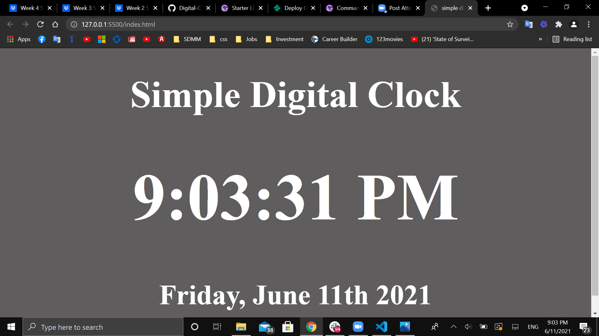

# Vanilla JavaScript Digital Clock App 

#### A simple digital Clock App written entirely in Javascript, HTML, and CSS.

#### Play it [here](https://mohammedq91.github.io/Digital-Clock-App/)

## Summary

In this project, I learned how several topics are being used in Javascript (i.e template literals, declaring a funcation, calling a function, storing date into a variable, const vs let vs var, conditional statement, and method vs property).

## Author

- **Mohammed Qaralos** - *Self taught Software Developer* - [Website]() | [LinkedIn](https://www.linkedin.com/in/mohammed-qaralos-27151010a/)
